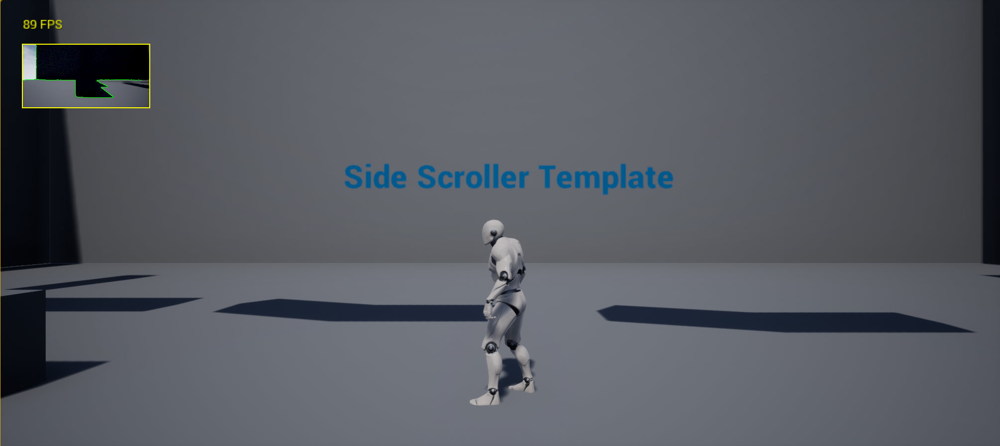

# About
This repository contains a simple example of how to use the OpenCV machine vision library in the UnrealEngine4
video game editor, allowing you add machine vision AI to your video games.  The example uses the stock SideScroller
game template with a a simple edge-detection algorithm, but can easily be
adapted to use other algorithms from OpenCV.

# Prerequisites

## Hardware

Check [here](https://docs.unrealengine.com/latest/INT/GettingStarted/RecommendedSpecifications/)
for the minimum hardware recommended by Unreal Engine.

## Toolchain

You will need Unreal Engine 4 (UE4). We are attempting to use the latest version, which as of the time of this
writing is UE4.18.2.  

Windows users will need Visual Studio Community (we're using the latest version, 2017).
If you don't have UE4 or Visual Studio 2017 installed, these
[instructions](https://docs.unrealengine.com/latest/INT/Programming/Development/VisualStudioSetup/#visualstudio2017users) 
will help get you started. If you've already been using C++ to develop video games with
older versions of these tools (Visual Studio 2015, UE 4.16), we recommend sticking with those, as we've found that
the differences between Visual Studio 2015 and 2017 can cause problems for UE4 if you're not careful (inability
to generate a .sln file from a .uproject file, inability to compile source code, etc.).

Linux users should follow these
[instructions](https://wiki.unrealengine.com/Building\_On\_Linux).  If (like
us) you like to build your projects from the bash command line, follow these
[instructions](https://forums.unrealengine.com/development-discussion/c-gameplay-programming/97022-linux-how-to-compile-c-scripts-from-terminal) to add a bash-shell command allowing you to do this.  <b>Because of the difficulties I've had getting
UE4 to run consistently on Linux, I cannot guarantee that this will work.</b>

# Build

You should first clone the <b>UE4_OpencCV</b> repository into your <b>Documents/Unreal Projects</b> folder, creating
that folder if it doesn't already exist.

To make sure that this program has access to the OpenCV libraries, the first
thing you should do is open the folder
<b>UE4_OpenCV\ThirdParty\OpenCV\Libraries\Win64</b>, copy the file
<b>opencv_world340.dll</b>, and paste it into the <b>C:\Windows\System32</b>
folder.  This will also help with any future programs you write using OpenCV.

Next, navigate back to the <b>UE4_OpenCV</b> folder, right-click on <b>OpenCV.uproject</b>, and
select the menu item <b>Generate Visual Studio project files</b>.  This should
create a file <b>UE4_OpenCV.sln</b> and some new folders.  If you don't get the
new .sln file, it's probably because UE4 cannot find a C++ compiler for the
version of Visual Studio you've installed (see discussion
[here](https://docs.unrealengine.com/latest/INT/Programming/Development/VisualStudioSetup/#beforesetting-upyourue4-to-vsworkflow)).
Double-clicking on the .sln file should launch Visual Studio.  The first time
you launch Visual Studio, it can take several minutes to parse up all the C++
source code for the UE4 engine.  

Finally, hit the <b>F5</b> key to launch launch the UE4 editor. Go to the <b>World Settings</b>
tab in the upper right, and under <b>Game Mode</b> open the <b>Selected GameMode</b>
item, and for <b>HUD Class</b> select <b>VisionHUD</b>. Now, when you press the Play
button, the upper-left of the display should present a little camera view
from the character's perspective, along with a report of the frame rate (FPS).

# How it works

The starting point for this project was the C++ code generated by the simple SideScroller example provided by 
UnrealEngine4.  Using the UnrealEditor, I created a Blueprint from the SideScrollerCPP character.
Then, based on this [video tutorial](https://www.youtube.com/watch?v=adYVI5XYmoI), I
used UnrealEditor to add a camera to the SideScroller character Blueprint, added a ScreenCaptureComponent2D
to the camera, and set the TextureTarget of the ScreenCaptureComponent2D to a TextureRenderTarget2D (referred to
as <b>T_Minimap</b> in the video).  Instead of adding a HUD as a Blueprint in UnrealEditor, I created
a [VisionHUD](Source/SideScrollerCPP/VisionHUD.h) class in C++, whose
constructor [loads](Source/SideScrollerCPP/VisionHUD.cpp#L16-L20)
the TextureRenderTarget2D object from the Blueprint and uses it to
[create](Source/SideScrollerCPP/VisionHUD.cpp#L22-L30) an FRenderTarget object.  The VisionHUD's DrawHUD method
[reads](Source/SideScrollerCPP/VisionHUD.cpp#L53-L54) the RGBA pixel values from the FRenderTarget,
[stores](Source/SideScrollerCPP/VisionHUD.cpp#L65-L67) the R, G, and B components into an ordinary
byte array, and [passes](Source/SideScrollerCPP/VisionHUD.cpp#L81-L82) the byte array to the OpenCV-based
machine-vision algorithm. Finally, I followed [this example](https://wiki.unrealengine.com/Multi-Threading:_How_to_Create_Threads_in_UE4) 
to make the vision algorithm run on its own thread.

# Modifying / Extending

To add a machine-vision HUD like this to another UE4 C++ project, you should use/modify the following files:

* [SideScrollerCPP.Build.cs](Source/SideScrollerCPP/SideScrollerCPP.Build.cs) As described in this 
[tutorial](https://wiki.unrealengine.com/Detailed_Account_Of_Integrating_OpenCV_Into_UE4_With_VS2017),
the contents (public and private methods) of this class can be copy/pasted into the .Build.cs class for your
project.

* [EdgeDetection.h](Source/SideScrollerCPP/EdgeDetection.h) / 
[EdgeDetection.cpp](Source/SideScrollerCPP/EdgeDetection.cpp) Modify and/or rename this class to run the
OpenCV algorithm(s) of your choice.  Your class should provide a static <tt>getInstance()</tt> factory method like
the one in EdgeDetection.cpp.

* [OnscreenDebug.h](Source/SideScrollerCPP/OnScreenDebug.h) / 
[OnscreenDebug.cpp](Source/SideScrollerCPP/OnScreenDebug.cpp) This class has nothing to do with machine vision; instead,
it provides a simple way to add onscreen debugging printout to your UE4 projects.  In this project, we're
[using](Source/SideScrollerCPP/SideScrollerCPPCharacter.cpp#L65-L70)  it to display the frame rate.

* [VisionAlgorithm.h](Source/SideScrollerCPP/VisionAlgorithm.h) Subclass this class to run your machine-vision 
algorithm.

# Related projects

Although I have not tried it out, the [UnrealCV](https://unrealcv.org/) project appears to be a fully
developed platform for exploring computer vision with UnrealEngine4.

